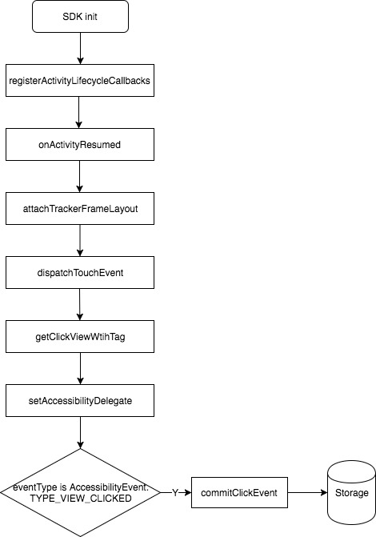
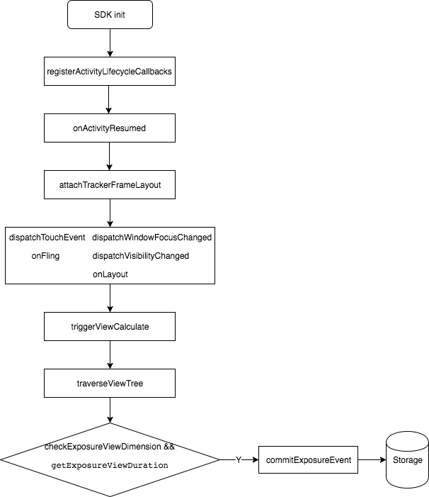
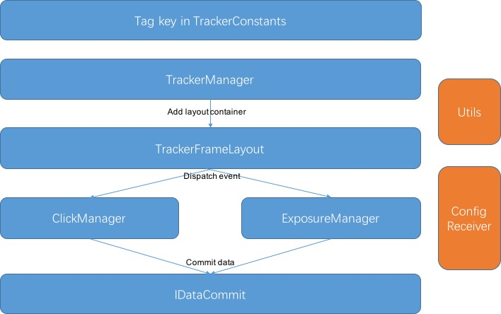

## Support event

1. click event: Android system definition, when user touch screen, trigger `MotionEvent.ACTION_DOWN` and `MotionEvent.ACTION_UP`.
2. exposure event: Application definition, when view appears in screen, width and height seen bigger than 80% of own width and height, furthermore duration longer than 100 ms, it is considered as a exposure event. Caller can set the custom time threshold and dimension threshold.

## Implementation
### Premise
1. When the app starts, init SDK, attach a custom `TrackerFrameLayout` on `onActivityResumed()` of `Application.ActivityLifecycleCallbacks`. This `TrackerFrameLayout` adds the contentView of page, thus the touch event and state changes of window can be dispatched by this `TrackerFrameLayout `container.
2. Remove the `TrackerFrameLayout` on callback method `onActivityDestroyed()`.

### Trigger the click event
1. Receive the touch event on the `dispatchTouchEvent()` of `TrackerFrameLayout` container.
2. According to the X/Y position of MotionEvent, find the clicked view with tag, set `AccessibilityDelegate` for that view.
3. Determines whether or not a click event by eventType, next commit data.

* flow chart shown below:

### Trigger the exposure event
1. Traverse the view tree of window on `TrackerFrameLayout`, save views with tag set by caller.
2. In the various application scenarios of APP, trigger the exposure calculation, statistics of each view of the start and the end of the exposure time to appear on the screen prevail, calculate the exposure time and number, commit data.

* flow chart shown below:

### Support application scenarios of the exposure event
1. All the view inside page end to expose by the state change of window, such as: window replace inside page, switch page in the TabActivity, enter into the next page, switch back and forth when press Home button.
2. Several views end to expose by the own state change, such as: begin to scroll, end to scroll, auto scroll, reusable view as well.
3. Excluding the Dialog, PopupWindow.

## Basic architecture

* The caller must set tag on views that need to be collected with key in the `TrackerConstants`, moreover implement `IDataCommit` interface to commit data.