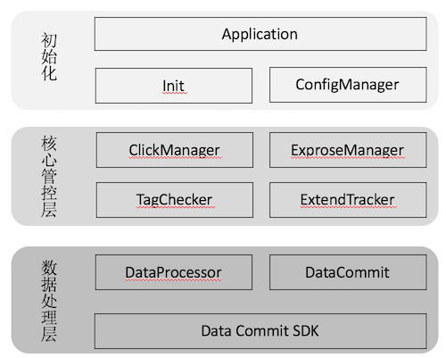
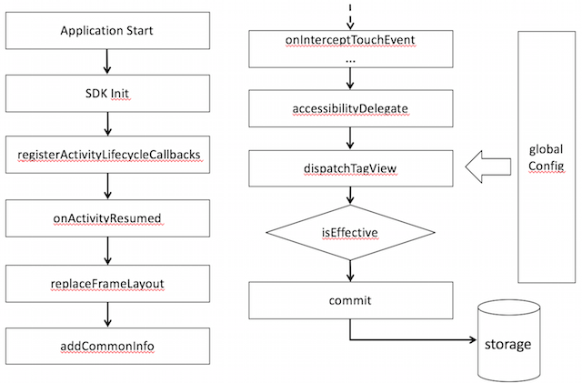

ViewTracker-Android
======

[:book: English Documentation](README.md) | :book: 中文文档

<!-- @import "[TOC]" {cmd="toc" depthFrom=1 depthTo=6 orderedList=false} -->
<!-- code_chunk_output -->

* [0 概述](#0-概述)
	* [0.1 功能特性](#01-功能特性)
	* [0.2 设计原则](#02-设计原则)
	* [0.3 整体架构](#03-整体架构)
	* [0.4 流程图](#04-流程图)
* [1 生命周期](#1-生命周期)
	* [1.1 系统属性](#11-系统属性)
	* [1.2 View属性](#12-view属性)
* [2 采集规范](#2-采集规范)
	* [2.1 点击事件规范](#21-点击事件规范)
	* [2.2 曝光事件规范](#22-曝光事件规范)
* [3 开发接入](#3-开发接入)
	* [3.1 依赖配置](#31-依赖配置)
	* [3.2 应用启动时初始化配置](#32-应用启动时初始化配置)
		* [3.2.1 启动初始化(必选)](#321-启动初始化必选)
		* [3.2.2 数据提交方式注入(可选)](#322-数据提交方式注入可选)
	* [3.3 Tag绑定](#33-tag绑定)
		* [3.3.1 点击&曝光Tag绑定(必选)](#331-点击曝光tag绑定必选)
		* [3.3.2 附加信息绑定(可选)](#332-附加信息绑定可选)
		* [3.3.3 页面公共信息绑定(可选)](#333-页面公共信息绑定可选)
		* [3.3.4 运行时信息设置方式（可选）](#334-运行时信息设置方式可选)
* [4 性能测试](#4-性能测试)
	* [4.1 性能测试目标](#41-性能测试目标)
	* [4.2 性能测试环境](#42-性能测试环境)
	* [4.3 性能测试结果](#43-性能测试结果)
* [5 开发作者](#5-开发作者)
* [6 许可证](#6-许可证licensetxt)
* [7 微信交流群](#7-微信交流群)

<!-- /code_chunk_output -->

# 0 概述

`ViewTracker`是用于自动化的采集用户UI交互过程中的点击和曝光事件，基于`view`事件代理及过滤的数据采集库。2016年3月份开始在天猫APP生产环境使用。

## 0.1 功能特性

* 支持`Android` & `iOS`（[iOS SDK github 仓库](https://github.com/alibaba/TMViewTrackerSDK)）平台。
* 支持采集点击事件、曝光事件。
* 支持采集页面公共信息。
* 支持多个场景：列表滑动，列表自动滚动，页面内`Window`切换，`Tab`页切换，进入下一个页面，应用前后台切换。
* 支持扩展：数据提交、曝光规则自定义(时间阈值和宽高阈值)、采样率定义等。

## 0.2 设计原则

* `KISS`原则（Keep It Simple, Stupid）：避免代码复杂化，类名、包名等都语义化，可读性好。
* `SRP`（单一责任原则）：某块代码功能，明确执行单一任务，如`Click`与`Expourse`区分。
* `OCP`（开闭原则）：最大化支持用户扩展开发，如可以替换数据提交的`IDataCommit`接口实现；提供广播的`receiver`入口，支持业务运行时的配置更新。

## 0.3 整体架构



## 0.4 流程图



# 1 生命周期

## 1.1 系统属性

* Application `onCreate`
* FrameLayout `onLayout` `onFling` `disPatchWindowFocusChanged` `dispatchVisibilityChanged`
* GestureDetector `onGestureListener`

## 1.2 View属性

* View `accessibilityDelegate`

# 2 采集规范

数据采集与后续的数据分析统计息息相关，不同事件的采集规范的约定至关重要。

## 2.1 点击事件规范

* EventId: `2101`
* ControlName: `button-1`
* args: `key1=value,key2=value`

## 2.2 曝光事件规范

* EventId: `2201`
* ControlName: `button-1`
* exposureTime: `500`
* args: `exposureIndex=1,key1=value`

# 3 开发接入

## 3.1 依赖配置

使用`gradle`:

```groovy
compile('com.tmall.android:viewtracker:1.0.0@aar')
```

## 3.2 应用启动时初始化配置

### 3.2.1 启动初始化(必选)

在应用启动时，调用如下代码：

```java
/**
 * SDK的初始化
 *
 * @param mContext   						全局的application
 * @param mTrackerOpen 					是否开启无痕点击埋点
 * @param mTrackerExposureOpen  是否开启无痕曝光埋点
 * @param printLog       				是否输出调试log
 */
TrackerManager.getInstance().init(mContext, mTrackerOpen, mTrackerExposureOpen, printLog);
```

### 3.2.2 数据提交方式注入(可选)

外部注入提交方式，实现`IDataCommit`接口

```java
Class DataCommit implments IDataCommit {
		...
		// 你的自定义实现
		...
}
TrackerManager.getInstance().setCommit(new DataCommit());
```

**注意**：  

在生产环境使用，应该是定制实现`IDataCommit`该接口，采集的日志数据才能上传保存到你的服务器端。

## 3.3 Tag绑定

业务方对于需要采集行为的`view`上绑定`tag`，分为以下几种场景。

### 3.3.1 点击&曝光Tag绑定(必选)

对于需要埋点的`view`，仅需要绑定`view`埋点名称。

```java
String viewName = "button-1";
view.setTag(TrackerConstants.VIEW_TAG_UNIQUE_NAME, viewName);
```

### 3.3.2 附加信息绑定(可选)

需要埋点的`view`还可以绑定附加扩展信息。

```java
HashMap<String, String> args = new HashMap<String, String>();
args.put(key, value);
...
view.setTag(TrackerConstants.VIEW_TAG_PARAM, args);
```

### 3.3.3 页面公共信息绑定(可选)

* 如果需要同一页面中的所有view上报都需要带上的信息，可以这样绑定（如果需要）。

```java
HashMap<String, String> args = new HashMap<String, String>();
args.put(key, value);
...
getWindow().getDecorView().setTag(TrackerConstants.DECOR_VIEW_TAG_COMMON_INFO, args);
```

### 3.3.4 运行时信息设置方式（可选）

服务端配置无痕点击`JSON`配置格式如下：

```js
{
    "masterSwitch": true, // 是否打开无痕点击事件上报
    "sampling":100 // 点击采样率
}
```

服务端配置无痕曝光`JSON`配置格式如下：

```js
{
    "masterSwitch": true, // 是否打开曝光事件上报
    "timeThreshold": 100, // view曝光时长阈值
    "dimThreshold": 0.8, // view曝光宽高阈值
    "exposureSampling": 100, // 曝光采样率
    "batchOpen":false // 是否打开批量上报，即页面离开时，所有view上报一次曝光总时长
}
```

应用接收到服务端配置后，发送广播，`SDK`内部可以接收到，动态修改配置。

```java
JSONObject config = new JSONObject();

// 获取服务端无痕点击配置
...
JSONObject exposureConfig = new JSONObject();

// 获取服务端无痕曝光配置
...
Intent intent = new Intent(ConfigReceiver.ACTION_CONFIG_CHANGED);
intent.putExtra(ConfigReceiver.VIEWTRACKER_CONFIG_KEY, config.toString());
intent.putExtra(ConfigReceiver.VIEWTRACKER_EXPOSURE_CONFIG_KEY, exposureConfig.toString());
context.sendBroadcast(intent);
```

# 4 性能测试

由于每一个本地页面都attach了一个`TrackerFrameLayout`，在`UI`主线程的事件处理方法中有曝光时间的计算操作，可能会对页面流畅度有一定影响，所以需要进行性能测试。

## 4.1 性能测试目标

帧率，监测使用`viewtracker`采集和原始代码提交埋点方式是否`FPS`有差别。

## 4.2 性能测试环境

* 手机型号：小米2
* 系统版本：`Android 5.0`
* APP版本：天猫`Android 5.32.0`
* 页面：首页

## 4.3 性能测试结果

类目      | 未使用ViewTracker   | 使用ViewTracker
--------- | ------------------- | -------------
测试次数  | 20                  | 20
MAX_FPS   | 60                  | 63
MIN_FPS   | 50                  | 47
AVG_FPS   | 54.81               | 53.90

测试数据来看，使用该无痕采集方式与传统代买提交方式FPS上无明显影响。

# 5 开发作者

* [@意海](https://github.com/deanhust) lizhiyonghust \<at> gmail \<dot> com
* [@蒙戈](https://github.com/denneyliu) lmaz \<at> 163 \<at> com
* @元休

# 6 [许可证](LICENSE.txt)

`Viewtracker`遵循`Apache License 2.0`协议，查看更多[协议](https://github.com/alibaba/android_viewtracker/blob/master/LICENSE.txt)信息。

# 7 微信交流群

* 微信群二维码容易过期，可在微信中搜索`Sunshine07de`。
